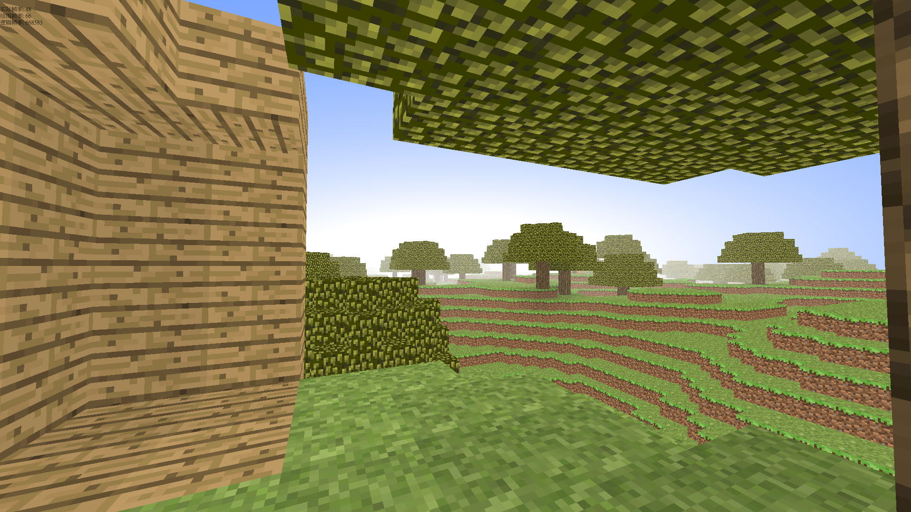

# 賣淫先鋒！

## 简介

Opengl的沙盒FPS遊戲！   
看起來很像某知名沙盒遊戲，成功地趕上了近年抄襲的主題(笑)。   

其實之所以要做這個是因爲玩了 BALDR HEART，我超喜歡這個世界觀，有時候在生成單位的時候會想是不是在遊戲裏的人看起來是海神中樞這樣的？   
不過話說回來， BALDR HEART 的戰鬥系統沒有劇本寫的那樣高自由度真可惜。

看起來是這樣: 

## 關於名字

FPS(First-Person Shejing)遊戲，翻譯過來大概就是第一人稱射精遊戲233333。

我知道你們一定要先吐槽這個名字(也許會想吐槽上面的簡介?)……   
一開始感覺像是minecraft又像是overwatch，索性就叫minewatch了。至於中文嘛，不如選用音義結合，前半取音，後半取義，所以是「賣淫先鋒」。   
感覺「成爲賣淫先鋒，和我一起賣淫吧」這樣的口號不錯呢。   

至於在哪裏賣淫，唔，因爲只是音譯所以現在還沒有(未來可能會有？)。   
有一種不明真相的同學玩了兩個小時以後一定會把我打一頓的錯覺……   

順便說一下，上次 @yjb767868009 告訴我這個其實更像堡壘之夜，然後我說「那不如就叫賣淫之夜」吧……後來想了想還是算了。

## 依賴

python3

pip install pyqt5 pyopengl pillow pyglet pywavefront opencv-python pyyaml

## 玩耍

python3 服务主机.py 來啓動伺服器   
python3 客户端.py 來啓動用戶端   

使用 *滑鼠* 來控制方向   
使用 *WASD* 來行走   
使用 *空白鍵* 來跳躍   
使用 *左鍵和右鍵* 來使用物品   
使用 *E鍵* 打開背包並選擇使用的物品   

# 關於資源佔用

在默認配置下: 

在我的64位win10臺式電腦上，客戶端初始佔用內存129M，直線奔跑3min後變成206M，服務端初始佔用56M，直線奔跑3min後變成70M。
(並不會釋放內存所以後來會怎麼樣我也不知道……)   
佔用網速大約在10KB~40KB之間。   
在廢銅爛鐵版surface3上姑且能有30幀。   

我只試過在低延遲的局域網(Wifi)內玩耍，有一次拿Note4做了一個熱點來玩，結果卡到爆炸……

不過我經常會更新，這個也不是每次都會測所以不及時，參考價值也不大……