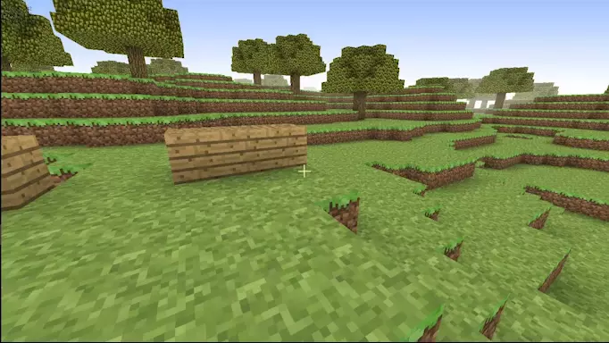
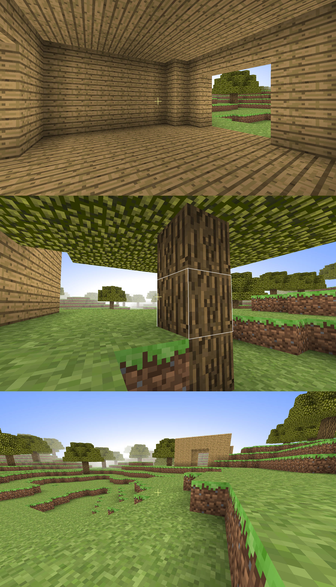

# minecraft

Opengl的沙盒FPS游戏！  
看起来很像某知名沙盒游戏，成功地赶上了近年抄袭的主题(笑)。   

看起来是这样: 

## 已实现功能

+ 玩法
    + 放置方块
    + 破坏方块
    + 收集掉落物品
    + 奇怪的技能

+ 渲染
    + 光照
        + 模拟光扩散
        + 模拟环境光遮蔽
    + 奇怪的粒子效果
    + 雾化
    + 优化
        + 地形分块刷新
        + 可见性裁剪

+ 地图
    + 种子生成
    + 无限大地图
        + 柏林噪声算法
    + 只有山坡、树、草地

+ 局域网联机

+ 触摸屏设备支持

## 其他图片

## 依赖

python3

pip install pyqt5 pyopengl pillow pyglet pywavefront opencv-python pyyaml

## 玩耍

`python3 服务主机.py` 来啓动伺服器  
`python3 客户端.py` 来啓动用户端   

或者直接 `python3 单机.py` 孤独地玩耍

## 关于性能

在默认配置下: 

在我的64位win10台式电脑上，客户端初始占用内存129M，直线奔跑3min后变成206M。  
服务端初始占用56M，直线奔跑3min后变成70M。  
(并不会释放内存所以后来会怎麽样我也不知道……)

占用网速大约在10KB~40KB之间。  
在我的废铜烂铁版surface3上姑且能跑上30帧。   
